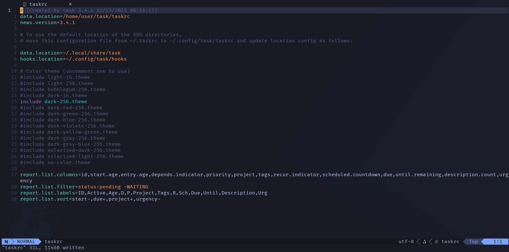

# tree-sitter-taskwarrior

A Tree-sitter grammar for Taskwarrior configuration files (`taskrc`), designed for accurate syntax parsing, structured highlighting, and long-term maintainability across Tree-sitter–powered editors.

## Background and Acknowledgement

This project is inspired by the earlier work  
[`tree-sitter-task`](https://github.com/) (now unmaintained for several years),  
which provided a minimalist Tree-sitter grammar to improve the editing experience of Taskwarrior-related files.

While that project focused on a minimal and pragmatic grammar, `tree-sitter-taskwarrior` takes a different approach:

- Actively maintained
- Grammar-first and semantics-aware
- Designed with long-term evolution and upstream integration in mind

Respect and appreciation are due to the original author for paving the way.

## About Taskwarrior

[Taskwarrior](https://github.com/GothenburgBitFactory/taskwarrior) is a powerful, flexible, and widely used command-line task management system.  
This grammar targets its configuration format (`taskrc`) and related files.

## Roadmap

This project is intentionally scoped for long-term maintenance. Planned work includes:

- [] Improve grammar precision and semantic modeling of Taskwarrior configuration keys
- [] Enhance comma-separated list parsing and highlighting (e.g. report fields)
- [] Expand and stabilize syntax highlighting queries
- [] Add comprehensive grammar and highlight tests
- [] Submit the project to the official Taskwarrior tools list (taskwarrior.org/tools)
- [] Submit the Tree-sitter grammar to `nvim-treesitter` for Neovim integration
- [] Submit the Tree-sitter grammar to `emacs-tree-sitter` for Emacs integration
- [] Publish a VS Code language extension supporting Taskwarrior configuration files

## Installation

This Tree-sitter grammar is under active development and is not yet distributed through editor upstreams or package registries.

Support for major editors (Neovim, Emacs, and VS Code) will be added incrementally as upstream integrations are completed. Until then, users may experiment with manual or local Tree-sitter setups if desired.

Official installation instructions will be documented once upstream support becomes available.

## Contributing

Contributions are welcome, including:

- Grammar improvements
- Additional tests
- Query enhancements
- Documentation improvements

Please keep changes focused and well-tested. Discussions and design feedback are encouraged via issues.

## License

This project is licensed under the MIT License.
